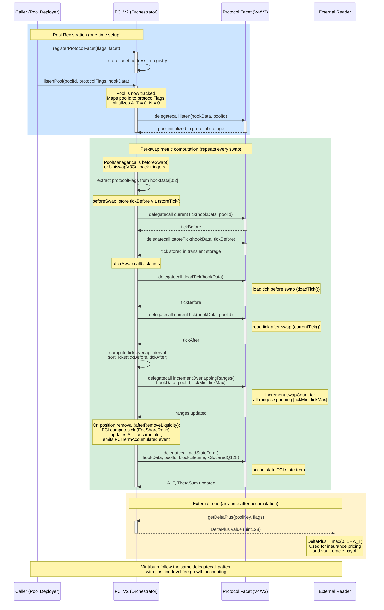

# FCI Pool Listening Flow -- Sequence Diagram

This diagram traces the full lifecycle of FCI metric tracking. It begins with `listenPool()` to register a pool for monitoring, then shows how each swap triggers metric computation via delegatecall dispatch to the appropriate protocol facet, and concludes with an external reader querying the derived `DeltaPlus` value. Mint and burn operations follow the same delegatecall dispatch pattern with position-level accounting.

